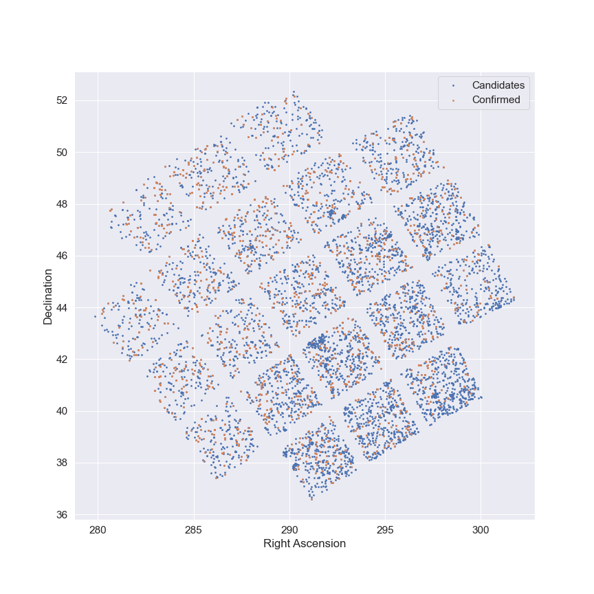
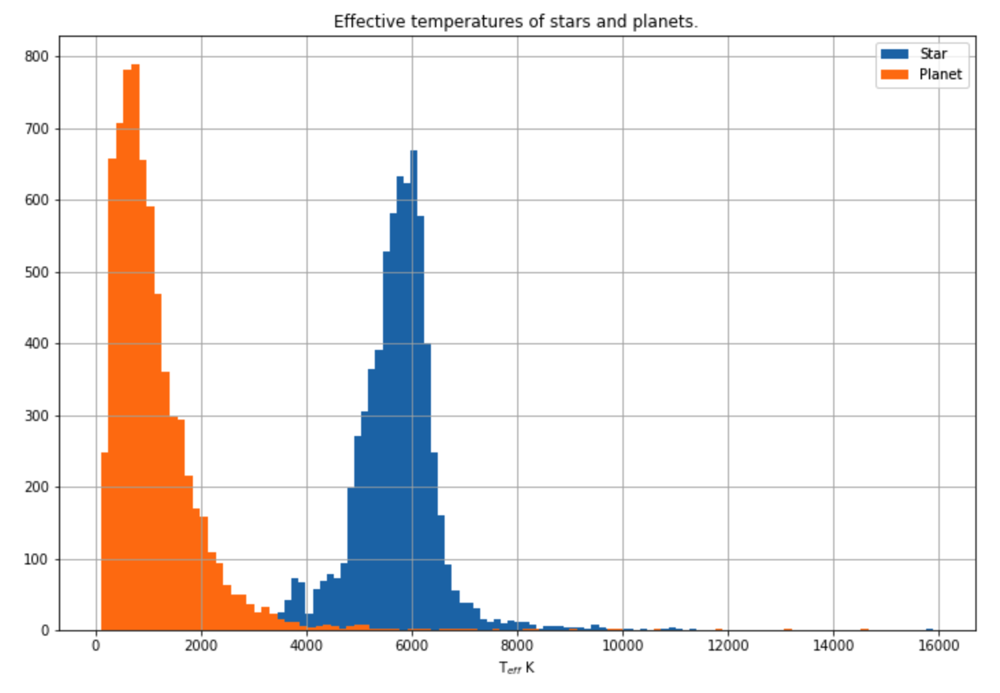
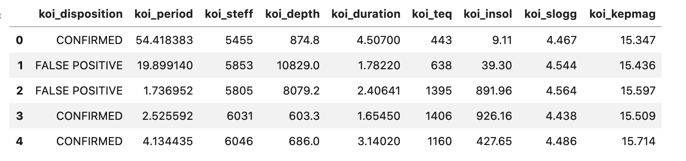
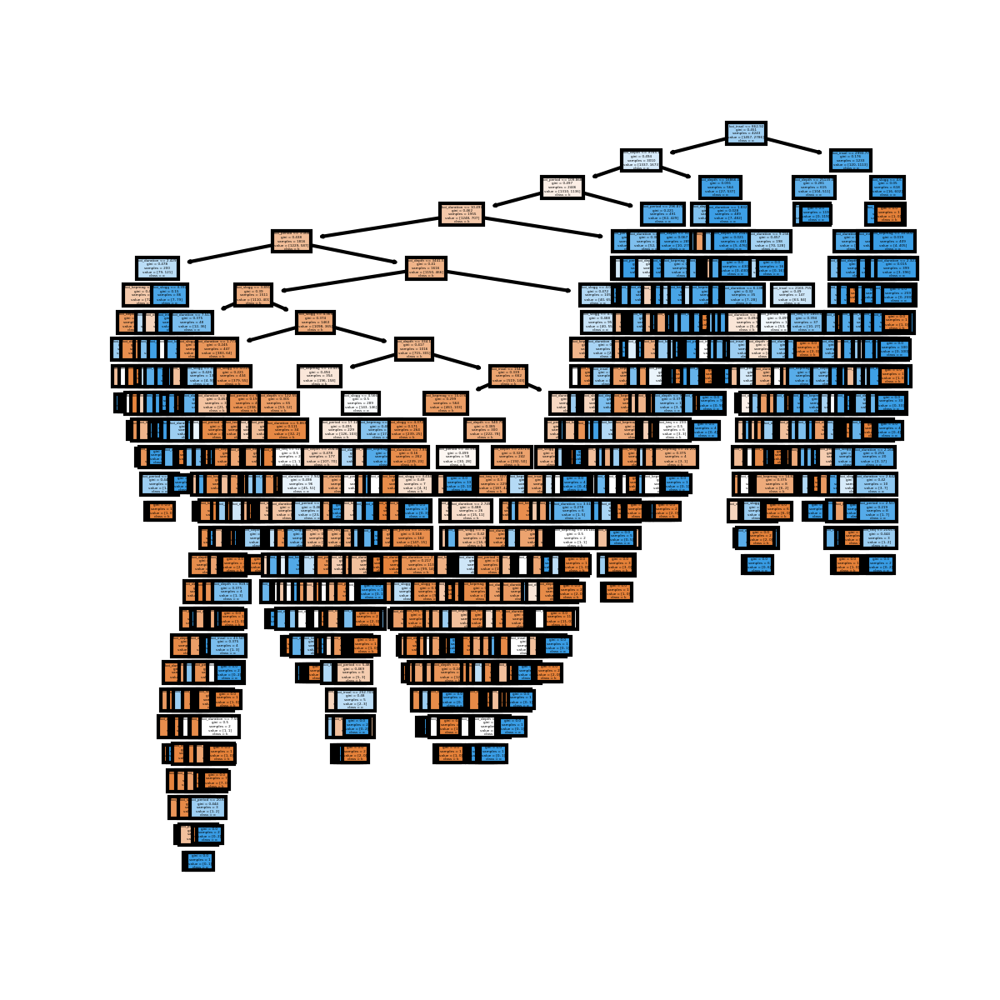
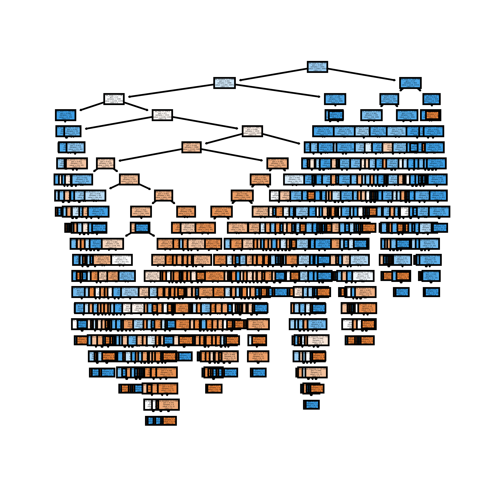
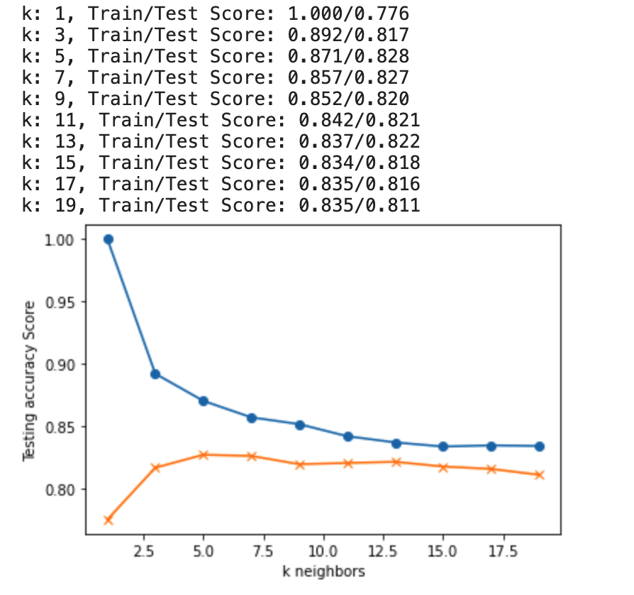
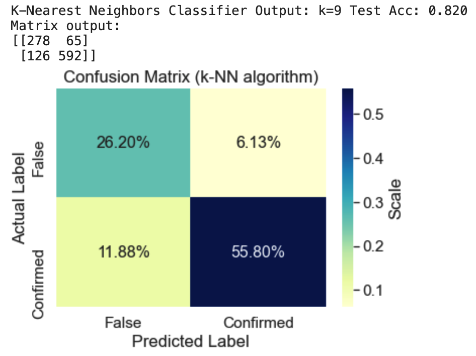

# machine-learning-challenge


* Process the NASA Kepler space telescope data
* Create machine learning models capable of classifying candidate exoplanets from the raw dataset
* Data Source: Kaggle
[Exoplanet Data Source](https://www.kaggle.com/nasa/kepler-exoplanet-search-results)


[](http://commonmark.org)
[](http://hits.dwyl.com/OlegRyzhkov2020/machine-learnoing-challenge)


[](https://www.jsdelivr.com/package/npm/chart.js)

## Data Exploration

* Right Ascension and Declination



* Temperatures and Radii of stars and planets



## Select Features



## Decision Tree Model
```Python
# Create and score a decision tree classifier
from sklearn import tree
clf = tree.DecisionTreeClassifier()
clf = clf.fit(X_train, y_train)
clf.score(X_test, y_test)

tree.plot_tree(clf);
```



## Random Forest Model
```Python
from sklearn.ensemble import RandomForestClassifier

# Create a random forest classifier
# Use not scaled data
rf = RandomForestClassifier()
rf = rf.fit(X_train, y_train)
rf.score(X_test, y_test)

# Estimators Visualization
fig, axes = plt.subplots(nrows = 1,ncols = 1,figsize = (4,4), dpi=800)
tree.plot_tree(rf.estimators_[0],
               feature_names = feature_names,
               class_names=target_names,
               filled = True);
```



## K-Nearest Neighbors Classifier
```Python
from sklearn.neighbors import KNeighborsClassifier

# Loop through different k values to see which has the highest accuracy
# Note: We only use odd numbers because we don't want any ties
train_scores = []
test_scores = []
for k in range(1, 20, 2):
    knn = KNeighborsClassifier(n_neighbors=k)
    knn.fit(X_train_scaled, y_train)
    train_score = knn.score(X_train_scaled, y_train)
    test_score = knn.score(X_test_scaled, y_test)
    train_scores.append(train_score)
    test_scores.append(test_score)
    print(f"k: {k}, Train/Test Score: {train_score:.3f}/{test_score:.3f}")


plt.plot(range(1, 20, 2), train_scores, marker='o')
plt.plot(range(1, 20, 2), test_scores, marker="x")
plt.xlabel("k neighbors")
plt.ylabel("Testing accuracy Score")
plt.show()

# Note that k: 9 provides the best accuracy where the classifier starts to stablize
knn = KNeighborsClassifier(n_neighbors=9)
knn.fit(X_train_scaled, y_train)
print('k=9 Test Acc: %.3f' % knn.score(X_test_scaled, y_test))


```




## Support Vector Machine  Model
```Python
# Create the SVC Model
from sklearn.svm import SVC
model = SVC(kernel='linear')
model
from sklearn.model_selection import GridSearchCV
param_grid = {'C': [1, 5, 10, 50],
              'gamma': [0.0001, 0.0005, 0.001, 0.005]}
grid = GridSearchCV(model, param_grid, verbose=3)

# Train the model
grid.fit(X_train_scaled, y_train)

```
## Deep Learning  Model


* Published Story Link: https://public.tableau.com/profile/oleg2035#!/vizhome/City_Bike_Analytics_16037248207960/Story
